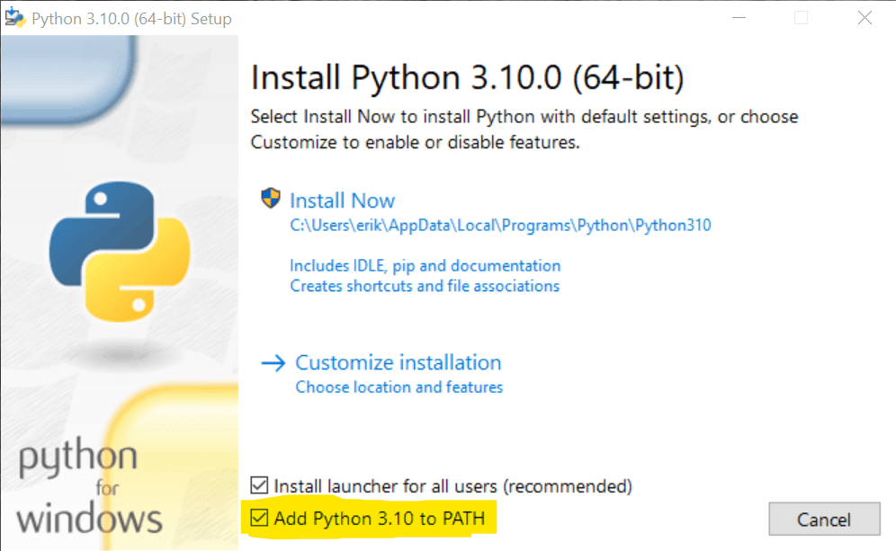

# Getting Started

## Installing Python 3

### Windows

Use the [installer](https://www.python.org/downloads/windows/) from the official website.

> [!IMPORTANT]
> Make sure to check **Add Python 3.12 to PATH**!



### macOS

Use [Homebrew](https://brew.sh) to install Python3.12.
You may need to install Homebrew as it is not pre-installed on macOS.

```bash
brew install python@3.12
```

### Linux

#### Ubuntu or Debian

```bash
sudo apt-get install software-properties-common
sudo add-apt-repository ppa:deadsnakes/ppa
sudo apt-get update
sudo apt-get install python3.12
```

#### Manjaro

```bash
pamac install python312
```

## Setting up a Development Environment

Anything that can edit plain text works for writing Python code.
However, using a more powerful editor makes your life a bit easier.

There are a lot of applications to choose from, but for this course we recommend using one of the following two:

### Visual Studio Code

[Visual Studio Code](https://code.visualstudio.com/) is currently _the_ most popular text editor for most programming languages.
Instead of including everything out of the box it relies on its built-in marketplace for extensions.
We strongly recommend using the official [Python Extension by Microsoft](https://marketplace.visualstudio.com/items?itemName=ms-python.python).

### PyCharm

[PyCharm](https://www.jetbrains.com/pycharm/) is a feature-rich IDE dedicated to Python and comes with everything out of the box.

> An [IDE (Integrated Development Environment)](https://en.wikipedia.org/wiki/Integrated_development_environment) is a text editors, that additionally provide helpful tools for running, managing and analyzing source code.

## Interactive Shell

Once installed, you should be able to run Python Interpreter in [Interactive Mode](https://docs.python.org/3/tutorial/interpreter.html#interactive-mode), also called the **Interactive Shell**:

```bash
python3.12
```

You should see something like this:

```bash
Python 3.12 (main, Oct 2 2023, 12:03:24) [Clang 15.0.0] on darwin
Type "help", "copyright", "credits" or "license" for more information.
>>>
```

The cursor should jump behind the `>>>`, ready to input some Python code.
We will use this to run some simple arithmetics and operations in the next chapter.

Exit the Interactive Shell either by pressing <kbd>Ctrl</kbd> + <kbd>D</kbd> or by entering `exit()` into the prompt.
