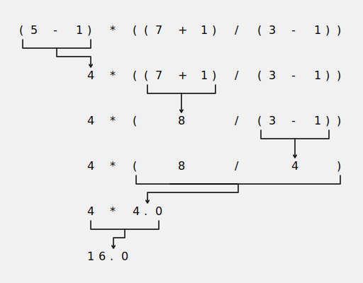

# Expressions

> [!NOTE]
> Launch the **Interactive Shell** by running the `python3.12` command in your terminal.

Enter `2 + 2` into the prompt to have Python do some simple math.
After pressing <kbd>Enter</kbd> it will display the result `4` and create a new prompt `>>>` for further inputs.

```bash
>>> 2 + 2
4
>>>
```

In Python, `2 + 2` is called an **_expression_**, which is the most basic kind of programming instruction.
Expressions always evaluate (that is, reduce) down to a single value.
In the previous example, `2 + 2` is evaluated down to a single value, `4`.

## Literals

The simplest type of an expression is a **_literal_**.
A literal only consists of a single value and always evaluates to itself.

```bash
>>> 2
2
```

## Arithmetic Expressions

The expression `2 + 2` we evaluated earlier is an **_arithmetic expression_**.
An arithmetic expression consists of an **_operator_** and either one _("unary")_ or two _("binary")_ **_operands_**.
The table below shows the most commonly used arithmetic operators with `x` and `y` representing the operands[^1].

| Operator | Operation                   | Example   | Result |
| -------- | --------------------------- | --------- | ------ |
| `x + y`  | sum of x and y              | `3 + 4`   | `7`    |
| `x - y`  | difference of x and y       | `5 - 2`   | `3`    |
| `x * y`  | product of x and y          | `2 * 5`   | `10`   |
| `x / y`  | quotient of x and y         | `10 / 4`  | `2.5`  |
| `x // y` | floored quotient of x and y | `10 // 4` | `2`    |
| `x % y`  | remainder of x / y          | `10 % 3`  | `1`    |
| `-x`     | x negated                   | `-5`      | `-5`   |
| `+x`     | x unchanged                 | `+5`      | `5`    |
| `x ** y` | x to the power of y         | `2 ** 3`  | `8`    |

Operands can not only be literal values, but any expression that evaluates to a number.
That means we can combine arithmetic expressions however we like.
The _order of operations_ (also called _precedence_) of math operators applies.

```bash
>>> 2 + 3 * 6
20
```

You may use parantheses to override the usual precedence.

```bash
>>> (2 + 3) * 6
30
```

For complex expressions Python will keep evaluating parts of the expression until it becomes a single value.

```bash
>>> (5 - 1) * ((7 + 1) / (3 - 1))
16.0
```



## Data Types

Remember that expressions always evaluate down to a single value.
A **_data type_** is a category for values, and every value belongs to exactly one data type.
Let's start with the most essential data types: **_integer_**, **_floating-point number_** and **_strings_**.

### Integer (`int`)

Integers are whole numbers.
For example the literal expressions `5`, `-2`, `0`, `9999` and the arithmetic expressions `2 + 2`, `5 - 2`, `2 * 5`, `10 // 4`, `10 % 3`, `2 ** 3` all represent a value of the integer data type.

You can also insert underscores `_` into integer (and floating-point number) literals to improve readability without changing the value.
This is useful for very large numbers, like `1_000_000`, which is equivalent to `1000000`.

### Floating-point number (`float`)

Numbers with a decimal point are called floating-point numbers (or floats).
Some literal expressions representing floats are `-1.25`, `0.5`, `0.0`, `0.000`, `1.0`, `+4.8`, `9999.99`.

> [!NOTE]
> Even though the value `42` is an integer, the value `42.0` is a floating-point number.

Float literals also support scientific notation, using either a lowercase `e` or capital `E`
to denote the exponent, e.g. `1e100`, `3.14e-10`, `0e0`, `-999E99`[^2].

Arithmetic expressions work the same way for floats as they do for integers.

```bash
>>> 2.0 + 2.0
4.0
```

> [!NOTE]
> Division (`/`) **always** evaluates to a float, even if both operands are integers.
>
> ```bash
> >>> 10 / 2
> 5.0
> ```

To make our lifes easier Python allows us to mix integer and floats in arithmetic expressions.
In this case the expression will always evaluate to a float.

```bash
>>> 10.0 // 4.0
2.0
>>> 10.0 // 4
2.0
>>> 10 // 4.0
2.0
>>> 10 // 4
2 # <- this is an integer!
```

### String (`str`)

TODO

## Variables

TODO

## Bonus

Try dividing by zero and see what happens.

## Recap

[^1]: [The Python Standard Library: Numeric Types — int, float, complex](https://docs.python.org/3/library/stdtypes.html#numeric-types-int-float-complex)
[^2]: [The Python Language Reference: Floating point literals](https://docs.python.org/3/reference/lexical_analysis.html#floating-point-literals)
