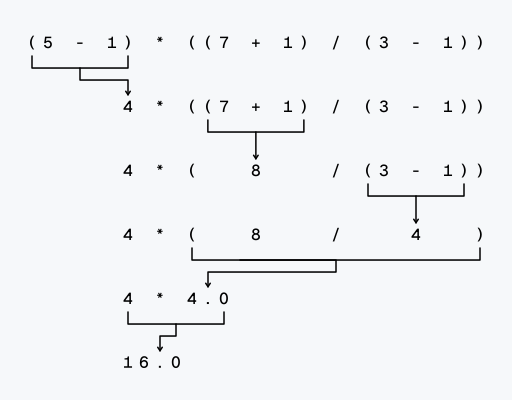

# Expressions

> [!TIP]
> Launch the **Interactive Shell** by running the `python3.12` command in your terminal.

Enter `2 + 2` into the prompt to have Python do some simple math.
After pressing <kbd>Enter</kbd> it will display the result `4` and create a new prompt `>>>` for further inputs.

```bash
>>> 2 + 2
4
>>>
```

In Python, `2 + 2` is called an **_expression_**, which is the most basic kind of programming instruction.
Expressions always evaluate (that is, reduce) down to a single value.
In the previous example, `2 + 2` is evaluated down to a single value, `4`.

## Literals

The simplest type of an expression is a **_literal_**.
A literal only consists of a single value and always evaluates to itself.

```bash
>>> 2
2
```

## Arithmetic Expressions

The expression `2 + 2` we evaluated earlier is an **_arithmetic expression_**.
An arithmetic expression consists of an **_operator_** and either one _("unary")_ or two _("binary")_ **_operands_**.
The table below shows the most commonly used arithmetic operators with `x` and `y` representing the operands[^1].

| Expression | Operation                   | Example   | Result |
| ---------- | --------------------------- | --------- | ------ |
| `x + y`    | sum of x and y              | `3 + 4`   | `7`    |
| `x - y`    | difference of x and y       | `5 - 2`   | `3`    |
| `x * y`    | product of x and y          | `2 * 5`   | `10`   |
| `x / y`    | quotient of x and y         | `10 / 4`  | `2.5`  |
| `x // y`   | floored quotient of x and y | `10 // 4` | `2`    |
| `x % y`    | remainder of x / y          | `10 % 3`  | `1`    |
| `-x`       | x negated                   | `-5`      | `-5`   |
| `+x`       | x unchanged                 | `+5`      | `5`    |
| `x ** y`   | x to the power of y         | `2 ** 3`  | `8`    |

Operands can not only be literal values, but any expression that evaluates to a number.
That means we can combine arithmetic expressions however we like.
The _order of operations_ (also called _precedence_) of math operators applies.

```bash
>>> 2 + 3 * 6
20
```

You may use parantheses to override the usual precedence.

```bash
>>> (2 + 3) * 6
30
```

For complex expressions Python will keep evaluating parts of the expression until it becomes a single value.

```bash
>>> (5 - 1) * ((7 + 1) / (3 - 1))
16.0
```



## Data Types

Remember that expressions always evaluate down to a single value.
A **_data type_** is a category for values, and every value belongs to exactly one data type.
Let's start with the most essential data types: **_integer_**, **_floating-point number_** and **_strings_**.

### Integer (`int`)

Integers are whole numbers.
For example the literal expressions `5`, `-2`, `0`, `9999` and the arithmetic expressions `2 + 2`, `5 - 2`, `2 * 5`, `10 // 4`, `10 % 3`, `2 ** 3` all represent a value of the integer data type.

You can also insert underscores `_` into integer (and floating-point number) literals to improve readability without changing the value.
This is useful for very large numbers, like `1_000_000`, which is equivalent to `1000000`.

### Floating-point number (`float`)

Numbers with a decimal point are called floating-point numbers (or floats).
Some literal expressions representing floats are `-1.25`, `0.5`, `0.0`, `0.000`, `1.0`, `+4.8`, `9999.99`.

> [!TIP]
> Even though the value `42` is an integer, the value `42.0` is a floating-point number.

Float literals also support scientific notation, using either a lowercase `e` or capital `E`
to denote the exponent, e.g. `1e100`, `3.14e-10`, `0e0`, `-999E99`[^2].

Arithmetic expressions work the same way for floats as they do for integers.

```bash
>>> 2.0 + 2.0
4.0
```

> [!TIP]
> Division (`/`) **always** evaluates to a float, even if both operands are integers.
>
> ```bash
> >>> 10 / 2
> 5.0
> ```

To make our lifes easier Python allows us to mix integer and floats in arithmetic expressions.
In this case the expression will always evaluate to a float.

```bash
>>> 10.0 // 4.0
2.0
>>> 10.0 // 4
2.0
>>> 10 // 4.0
2.0
>>> 10 // 4
2 # <- this is an integer!
```

### String (`str`)

A String is a sequence of letters and any other character defined in the [Unicode Standard](https://unicode.org/charts/).
This also includes spaces, numbers and even emojis.
Think of a string as a piece of text.

In general a string literal is surrounded in quotes so Python knows where the string begins and ends:

|                     | Example                                                                       |
| ------------------- | ----------------------------------------------------------------------------- |
| Single Quotes       | `'aababab'`, `'Alice'`, `'Hello World!'`, `'allows embedded "double" quotes'` |
| Double Quotes       | `"aababab"`, `"Alice"`, `"Hello World!"`, `"allows embedded 'single' quotes"` |
| Three Single Quotes | `'''aababab'''`, `'''Alice'''`, `'''Hello World!'''`                          |
| Three Double Quotes | `"""aababab"""`, `"""Alice"""`, `"""Hello World!"""`                          |

You can even have a string with no characters in it, called a _blank string_ or an _empty string_:
`''`, `""`, `''''''`, `""""""`.

Since strings are not numeric like integers and floats, you cannot use arithmetic operations.
Here, we use **_sequence operations_** to combine strings instead[^3].

| Expression         | Operation                                                                              | Example                    | Result         |
| ------------------ | -------------------------------------------------------------------------------------- | -------------------------- | -------------- |
| `s + t`            | The concatenation of `s` and `t`                                                       | `'hello' + 'world'`        | `'helloworld'` |
| `s * n` or `n * s` | Equivalent to adding `s` to itself `n` times                                           | `'abc' * 3`                | `'abcabcabc'`  |
| `s[i]`             | _i_-th item of `s`, starting at 0                                                      | `'hello'[1]`               | `'e'`          |
| `s[i:j]`           | Slice of `s` from `i` to `j`                                                           | `'hello'[1:3]`             | `'el'`         |
| `s[i:j:k]`         | Slice of `s` from `i` to `j` with step `k`                                             | `'abcdefghij'[1:6:2]`      | `'bdf'`        |
| `len(s)`           | Length of `s`                                                                          | `len('hello')`             | `5`            |
| `s.index(x)`       | Index of the first occurrence of `x` in `s`                                            | `'hello'.index('l')`       | `3`            |
| `s.index(x, i)`    | Index of the first occurrence of `x` in `s` at or after index `i`                      | `'hello'.index('l', 3)`    | `3`            |
| `s.index(x, i, j)` | Index of the first occurrence of `x` in `s` at or after index `i` and before index `j` | `'hello'.index('l', 3, 5)` | `3`            |
| `s.count(x)`       | Total number of occurrences of `x` in `s`                                              | `'hello'.count('l')`       | `2`            |

In the table above, `s`, `t` are strings and `i`, `j`, `k`, `n` are integers.

> [!TIP]
> Remember that `s` and `t` don't have to be literals.
> They can be any expression that evaluates to the string data type.
> The same applies to the integers `i`, `j`, `k`, `n` respectively.
>
> ```bash
> >>> ('knock' * (12 // 4)) + 'penny'
> 'knockknockknockpenny'
> ```

For better understanding of the slice and index operations it's worth mentioning that every character in a string, _including spaces_, is assigned to an integer.
The first character in the string is assigned to the number `0`, the second to `1` and so on.
These numbers are called **_index_** (pl. **_indices_**).
For the string literal `'Hello World!'` the indices are as follows.

| Character | `H` | `e` | `l` | `l` | `o` |     | `W` | `o` | `r` | `l` | `d`  | `!`  |
| --------- | --- | --- | --- | --- | --- | --- | --- | --- | --- | --- | ---- | ---- |
| Index     | `0` | `1` | `2` | `3` | `4` | `5` | `6` | `7` | `8` | `9` | `10` | `11` |

## Variables

So far we have only created literals and combined them using arithmetic and sequence operations.
We need some way of storing any information and manipulate them as well.
This is where **_variables_** come into the picture.
Variables are exactly what the name implies: Their value can vary, i.e., you can store anything using a variable.
Variables are just parts of your computer's memory where you store some information.

### The Assignment Statement

Unlike an expression, which _always_ evaluates to a single value, a **_statement_** describes an instruction that only _does something_ but not _is something_.

The first statement you will use frequently is the _**assignment statement**_ and consists of a variable name (called an **_identifier_** ), the **_assignment operator_** `=` , and an _expression_ whose result to store.

For example we create a variable named `x` and store the value `5` in it:

```bash
>>> x = 8
```

Here, `x` is the _identifier_, and `5` is a _literal expression_.

Likewise, we create another variabled with the identifier `y`, where we store the result of the arithmetic expression `2 + 2`.

```bash
>>> y = 2 + 2
```

If we assign something to a variable that already exists, the value that's currently being stored gets overwritten by the new one.

For example after executing the following two assignment statements, `x` contains the value `5`:

```bash
>>> x = 8
>>> x = 5
```

Identifiers are not limited to single characters.
You can choose any identifier as long as you adhere to the following rules:

1. The first character of the identifier must be a letter of the alphabet or an underscore (`_`).
2. The rest of the identifier name can consist of letters, underscores (`_`) or digits (`0` &ndash; `9`).

> [!TIP]
> Identifier names are case-sensitive. For example, `myname` and `myName` are not the same.

For example `x`, `Name`, `name_2_3` are all valid identifiers.
Invalid identifiers are e.g. `2things`, `this is spaced out`, `my-name` and `>a1b2_c3`.

### The Variable Expression

To get the result of a variable we introduce a new type of expression: **_Variable Expressions_**.
Once a variable is created and given an identifier, that very same identifier becomes a valid expression and evaluates to the value stored in the variable.

We can use these in the interactive shell to read the values stored in the variables `x` and `y` we created earlier.

```bash
>>> x
5
>>> y
4
>>> x + y
9
```

<!-- TODO: Organize Quiz separately -->

> [!NOTE]
> **Pop Quiz:** What gets displayed after executing the following?
>
> ```bash
> >>> a = 8
> >>> b = 2 * 3
> >>> b = b * 2
> >>> a + b
> ?
> ```

[^1]: [The Python Standard Library: Numeric Types — int, float, complex](https://docs.python.org/3/library/stdtypes.html#numeric-types-int-float-complex)
[^2]: [The Python Language Reference: Floating point literals](https://docs.python.org/3/reference/lexical_analysis.html#floating-point-literals)
[^3]: [The Python Standard Library: Common Sequence Operations](https://docs.python.org/3/library/stdtypes.html#common-sequence-operations)
