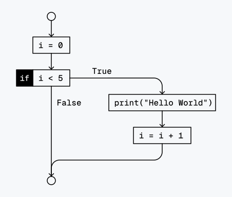
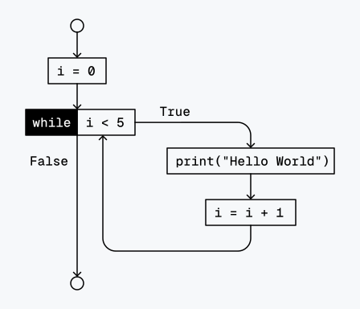

# Control Flow 2

## Loops

### `while` statement: the conditional loop

You can make a block of code execute over and over again using a `while` statement.
The code in a while clause will be executed as long as the `while` statement’s condition evaluates to `True`.

In code, a while statement always consists of the following:

- The `while` keyword
- A condition (that is, an expression that evaluates to `True` or `False`)
- A colon (`:`)
- Starting on the next line, an indented block of code

You can see that a while statement looks similar to an `if` statement.
The difference is in how they behave.
At the end of an `if` statement, the program execution continues after the if statement. But at the end of a while statement, the program execution jumps back to the start of the while statement.

Let’s look at an `if` statement and a `while` loop that use the same condition and take the same actions based on that condition.

**Example**
```python
i = 0
if i < 5:
    print("Hello World")
    i = i + 1
```
**Output**
```console
Hello World
```
**Flowchart**



**Example**
```python
i = 0
while i < 5:
    print("Hello World")
    i = i + 1
```
**Output**
```console
Hello World
Hello World
Hello World
Hello World
Hello World
```
**Flowchart**



### `for` statement: the sequence loop

```python
for c in "Hello":
    print(c)
```
**Output**
```console
H
e
l
l
o
```

_Editor's Note: What's the output of the following script?_
```python
for c in "Hello":
    print("Hello")
```

## The "List" and "Tuple" Sequence Data Types

So far we established `string` data type, which consists of a sequence of Unicode symbols.
Going a step further, we can generalize the concept of sequences and obtain two new data types: _**Lists**_ and _**Tuples**_.

### List

Similar to a `string`, a list is a sequence of values, however instead of being limited to single unicode symbols, the elements can be of any size and data type.
Lists may contain items of different data types, but usually the items all have the same type.

The literal expression of the List data type consists of comma-separated values, wrapped in square brackets (`[`, `]`)

For example, let `a`, `b` and `c` be expressions of any data type.
A List containing `a`, `b` and `c` in this order looks like this:
```
[a, b, c]
```

We can use the same sequence operations we learned earlier with strings:
```console
>>> ["one", "two", "three"] + ["four", "five"]
["one", "two", "three", "four", "five"]
```


### Tuple


## The `range()` expression

```python
for i in range(0, 5):
    print("Hello World")
```

## Loop control

### `continue`
The continue Statement can be used to skipp the current iteration and start from the beginning. Depending on the Iteration type 2 things can happen:
 - for Loop:

   the next element will be selected
 - while Loop:

   the condition will be checked again


For example:

print the numbers 1-10 except the 7
```python
for i in range(1,10):
    if i == 7:
        continue
    print(i)
```

### `break`

you can use the break Statement to exit a loop early.

Here we want to print the numbers 1-10 using the while True loop.

```python
for i in range(1,100):
    if i == 10:
        break
    print(i)

```