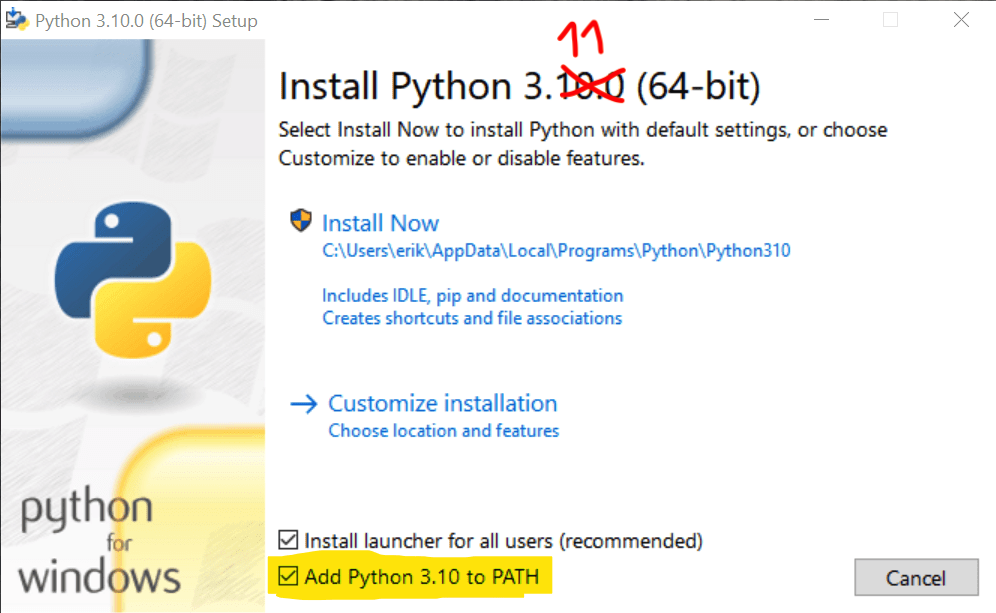

# Lesson 01

## Choose an IDE
First choose an IDE for your Projects. We strongly recommend one of these Options:
- Pycharm / Jetbrains
- Visual Studio Code


## Install Python

### MacOS
Use [Homebrew](https://brew.sh) to install Python3.11
```shell
brew install python@3.11
```

### Windows

Use the [installer](https://www.python.org/downloads/windows/) from the Official Website.

> [!IMPORTANT]
> 
> Make sure to check "Add Python 3.11 to PATH"!
> 

### Linux

#### Debian or Ubuntu
Use apt to install Python3.11
```shell
sudo apt update
sudo apt install python3.11 -y
```

#### Arch Linux or Manjaro
```shell
pacman -S python
```

## Helpful Resources

Official Installation Guide: https://wiki.python.org/moin/BeginnersGuide/Download